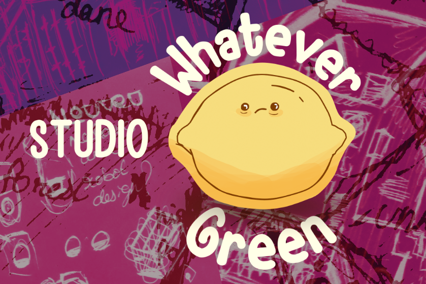

---
Falooda is a game framework for game development in the GODOT game engine to make making new games easier and quicker!!
built by STUDIO whatever green ❤️
Falooda will be used and maintained well into development for other games, and features from those games will be implemented into here aswell

Falooda would include:
1. [ ] 3rd Person Character Controller
2. [ ] Object Collision
3. [ ] Map system
4. [ ] Dialogue with and without audio
5. [ ] Adpative music system
6. [ ] Intergration with Github Build Tools

---
## Running Falooda
[in prose]

